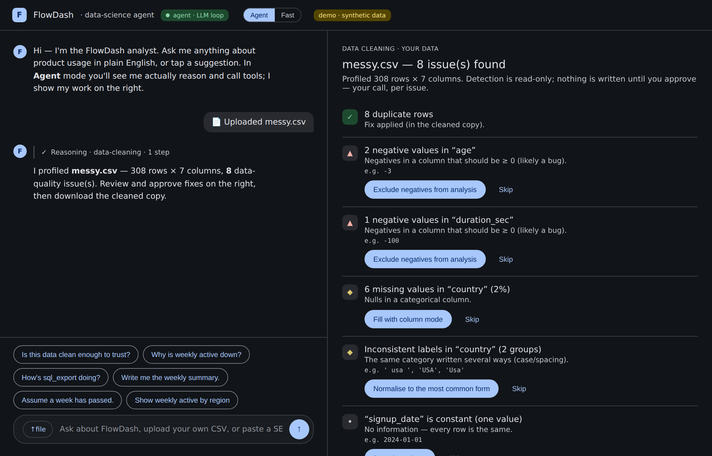
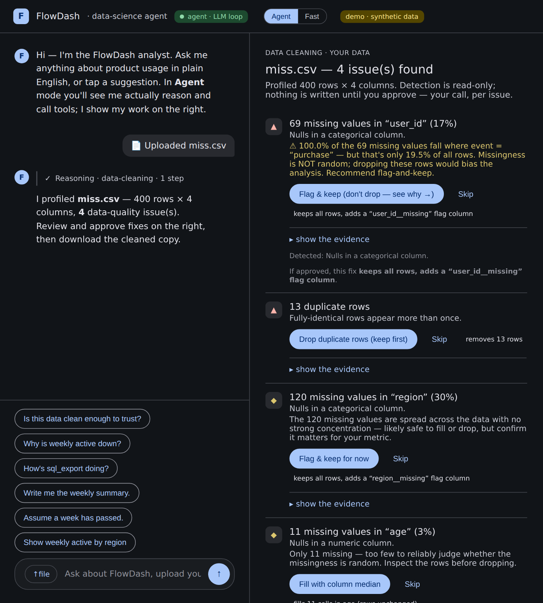
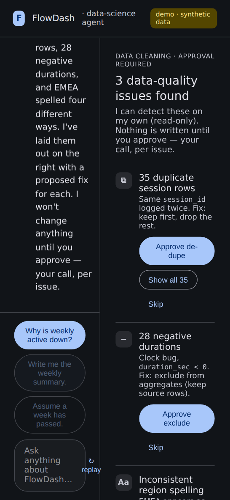
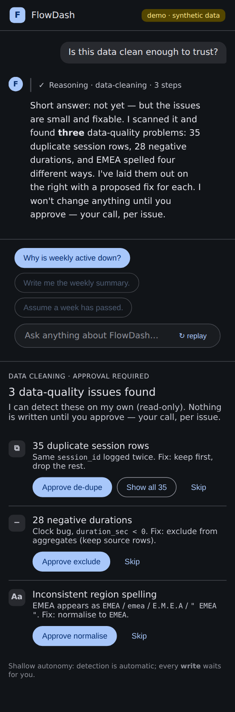
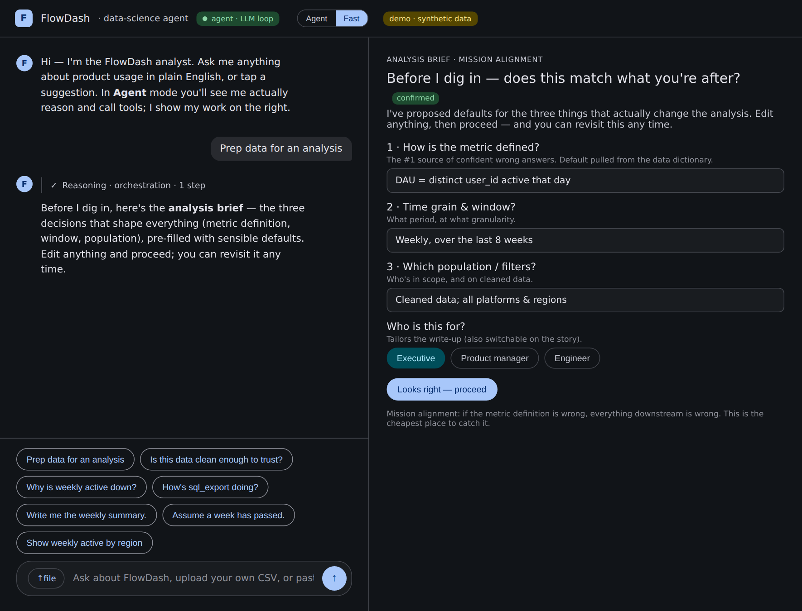
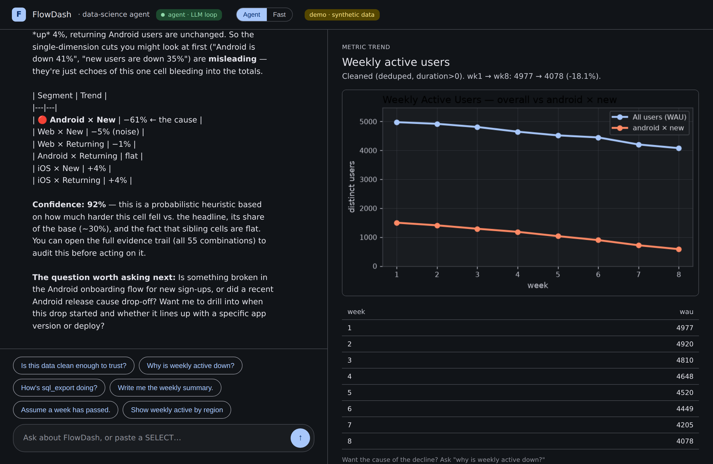

# FlowDash DS-Agent — Case Study & Decision Log

A working record of the **key product/UX decisions**, the **options weighed**, the
**rationale** (grounded in published agentic-design guidance), and **before → after**
evidence. Written to be portfolio-ready: it favors *why* over *what*.

**What this is:** an exploration of where an agent UX adds value across a data-science
workflow — *cleaning → key-driver → storytelling → alert → orchestration* — for a
non-technical PM persona (“Maya”). Demo, not a product.

**Credible sources referenced** (abbreviated inline):
- **Anthropic**, *Building Effective Agents* (2024) — simplicity, transparency, tool/ACI design.
- **OpenAI**, *A Practical Guide to Building Agents* (2025) — guardrails, human-in-the-loop on irreversible actions.
- **Google PAIR**, *People + AI Guidebook* — set expectations, explain, calibrate trust.
- **Microsoft HAX** guidelines (Amershi et al., CHI 2019) — “make clear why,” “support efficient correction.”
- **NN/g** heuristics — visibility of system status, user control & freedom, recognition over recall.
- **Horvitz**, *Principles of Mixed-Initiative UI* (CHI 1999) — ask only when uncertainty × cost is high.
- **Little & Rubin**, *Statistical Analysis with Missing Data* — MCAR / MAR / MNAR.

---

## Decision log (chronological)

| # | Decision | Options weighed | Chose | Why (source) |
|---|---|---|---|---|
| 1 | **How "real" is the agent?** | (a) mock/scripted; (b) deterministic rule router; (c) real LLM agentic loop | **All three, layered** — real Claude Agent SDK loop as default, rule router as instant fallback, static scripted build for the hosted link | Match effort to context; keep it real where it matters, degrade gracefully (Anthropic *simplicity + transparency*). |
| 2 | **Design language** | new system vs reuse prior "Jetski" demo | **Reuse Jetski** (Material 3 dark) via extracted design tokens | Consistency; isolates restyle to one file. |
| 3 | **Cleaning: mutate vs propose** | auto-clean vs approval-gated | **Detect autonomously (read-only), gate every write** | Reversibility; OpenAI *human-in-the-loop on irreversible actions*; NN/g *user control*. |
| 4 | **Probabilistic claims** | show answer vs show answer + evidence | **Always ship the evidence trail** ("▸ show the evidence") | Trust calibration (PAIR); HAX *"make clear why."* |
| 5 | **Responsive layout** | ship desktop-only vs audit first | **Audited at 4 widths, added breakpoints** | Visibility of system status across contexts (NN/g). *(before/after below)* |
| 6 | **Generic vs demo-only cleaning** | FlowDash-only vs any dataset | **Generic pandas profiler** (drop any CSV) | Real usefulness; the agent shouldn't be a puppet. |
| 7 | **Missing-value handling** | offer drop/fill vs diagnose first | **Diagnose missingness (structured vs random) before proposing; default flag-don't-delete** | MCAR/MAR/MNAR — deleting non-random nulls biases results. *(the strongest decision; before/after below)* |
| 8 | **Kickoff clarifying questions** | ask-first gate vs proceed-on-defaults vs ambiguity-triggered | **Ask 1–3 decision-changing questions, propose defaults, capture as an editable Analysis Brief** | Horvitz mixed-initiative — a few high-value questions, not an interrogation (Opus over-asks). |
| 9 | **Storytelling audience** | free-text vs preset chips vs infer | **Audience chips (Exec/PM/Eng) that re-tailor** | Lowest friction, most demoable; PAIR *set expectations*. |
| 10 | **Hosting** | Vercel vs GitHub Pages vs local | **GitHub Pages for the static UI**; live agent runs locally | Sandbox couldn't reach Vercel; Pages was automatable end-to-end. |

---

## Deep dive: the decisions worth showing

### A. Missing values — diagnose *why* before deleting (decision #7)
**The feedback that triggered it:** a data scientist noted that if all the null `user_id`
are *purchase events*, you can't safely drop them — you'd bias the dataset.

**Before:** the profiler offered a blunt *"fill median / drop rows"* for any null column —
no diagnosis. That's the generic-tool default, and it's statistically unsafe.

**After:** before proposing a fix, the profiler cross-tabs the null mask against every
other column. If nulls concentrate in one category far beyond its baseline prevalence, it
flags the missingness as **structured (not random)**, warns that dropping would bias the
analysis, and **defaults to flag-and-keep** (adds a `col__missing` indicator) instead of
delete. A minimum-count guard (`n_null ≥ 20`) stops small-sample false positives; diffuse
and too-few cases are labeled honestly.

| Before | After |
|---|---|
|  |  |

*Principle:* Little & Rubin (MCAR/MAR/MNAR); Anthropic *show your work*; HAX *"make clear
why" + "support correction."* This is where generic data cleaning becomes **data prep**.

### B. Responsive audit (decision #5)
**Before:** built desktop-first; the chat|canvas split had no breakpoints, so on a phone
both panes were crushed (390px → 170px each, one word per line). **After:** below 860px the
layout stacks to a single full-width column; the header condenses. Desktop unchanged.

| Before (390px) | After (390px) |
|---|---|
|  |  |

*Principle:* NN/g *visibility of system status*. Lesson: **audit with real renders, don't
eyeball** — the bug was invisible at desktop width.

### C. Kickoff — the editable Analysis Brief (decision #8)
A "prep data for X" request opens with the **three decisions that actually change the
analysis** (metric definition, window, population) pre-filled with defaults, plus an
audience selector. The user edits and proceeds; the brief then rides atop every analysis
card as a one-line banner with an "adjust" link.

*Principle:* Horvitz mixed-initiative (ask only high-value questions, propose defaults);
NN/g *user control*. The design tension named explicitly: **alignment vs. friction** —
Opus 4.8 tends to over-ask, so the brief bounds questioning to 1–3 and makes the answers
*editable state* rather than a blocking gate.

### D. The real agent, reviewable (decision #1)
The agent is a genuine Claude Agent SDK loop: it reads the project skills, decides which
tools to call, runs real SQL, and **streams its thinking + tool calls** to the UI so the
reasoning is auditable.

*Principle:* Anthropic *transparency* — an agent you can review beats an agent you must trust.

---

## Cross-cutting UX principles (the through-line)
1. **Inference ≠ truth.** Every probabilistic output (a driver, a confidence score, a
   missingness verdict) ships with its evidence and an easy override. (Anthropic; HAX; PAIR)
2. **Read-only is free; writing needs a yes.** Detection is autonomous; mutation is gated
   and non-destructive (clean *copies*, flag-don't-delete). (OpenAI; NN/g)
3. **Mission alignment is the cheapest bug fix.** Get the metric definition right up front
   or everything downstream is wrong — but bound the questioning. (Horvitz)
4. **Show impact, not just intent.** Each fix states what it changes ("removes 13 rows").
   (HAX *"make clear how well"*)

## Honest gaps / next (not yet built)
- **Non-linear re-entry** — real prep loops back (profiling changes the join); the flow is
  still somewhat linear. (NN/g *user control & freedom*)
- **Reproducible recipe + verification** — accepted steps should accrue into a runnable
  script that self-checks (did the join multiply row counts?).
- **Column lineage / data-dictionary surfacing** per column (the feedback's "protobuf defs"
  generalized).
- **Live agent on a public URL** — needs a Python host; currently local-only.

*Live static preview:* https://ashlithos.github.io/datascience/ · *Full app:* `python server/app.py`
