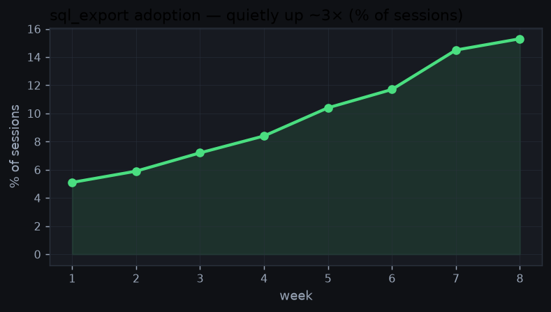
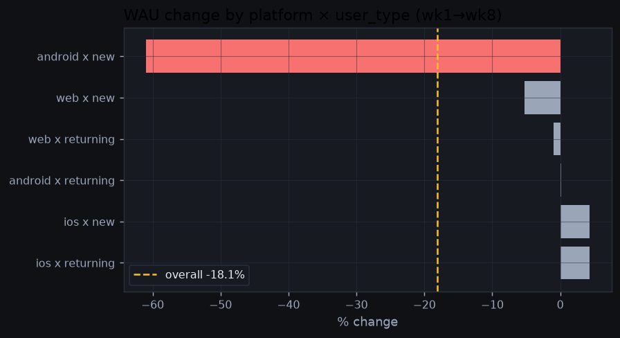

# The thing nobody's looking at is going right

*Version B · the agent chose this structure. Same 8 weeks, same cleaned data as
Version C — only the framing differs.*

Everyone's about to spend this week panicking about the **18% drop in active users**.
Before we do, here's something I'd hate for us to miss in the noise:

> **`sql_export` — the power-user feature — has tripled.** From 5% of sessions to 15%
> in eight weeks, climbing every single week, with zero marketing.

That's a real signal about where FlowDash is becoming *sticky*: people aren't just
viewing dashboards, they're pulling data out to work with it. I'd protect and study
this before anything else.

---

Now, the 18% drop — because it's real, and it has a precise cause.

It is **not** "everyone's leaving." It's one segment: **new users on Android, down
~61%.** I checked every platform, region, tenure and plan, alone and crossed (55
combinations). Android-new is the only thing falling off a cliff — and because it's
nearly a third of the base, it drags the whole headline down with it. Everyone else
is flat.

The trap: if you'd only looked at "platform = Android" you'd have seen −41% and blamed
all of Android; "new users" reads −35% and you'd blame onboarding generally. Both
half-true, both misleading. It's the **intersection** that's broken. *I'm ~92% sure.*

**One more thing, while I have you:** week 6, EMEA errors briefly hit ~7% — but it was
a two-hour blip right after the `v2026.06.03` deploy, not an ongoing problem. Flagging
so it's on the record, not because it's on fire.

---

**If I were you, this week:** (1) tear into Android new-user onboarding — that's the
whole story behind the scary number; (2) figure out what's driving `sql_export` and
feed it; (3) close the loop on the EMEA deploy.

*Want the queries behind any of this? Ask and I'll show my work.*
