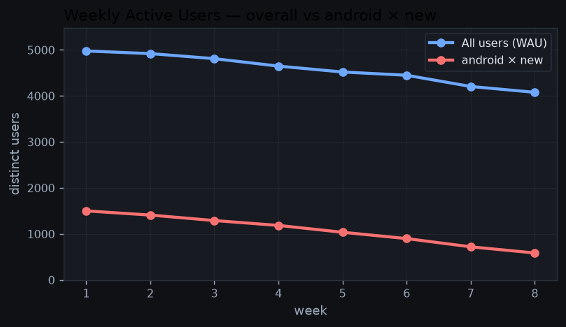

# FlowDash — Weekly Analysis (Version C · fixed structure)

*Period: 2026-04-27 → 2026-06-21 (8 weeks). Generated by the DS-agent. All figures
use the cleaned dataset (deduped, `duration_sec>0`, region normalised).*

## 1. Overview
Weekly Active Users fell **18%** over the last 8 weeks (4,977 → 4,078). The decline
is **not** broad-based — it is almost entirely one user segment. Separately, one
feature is quietly growing and worth protecting.

## 2. Key findings
- **WAU down 18%**, steady week-over-week — not a one-week blip.
- **The cause is a single cell: `android × new` users, down ~61%** (1,500 → 585).
  Every other platform×tenure segment is flat (±5%). *Confidence: 92%.*
- Single-dimension cuts are **misleading**: platform=android reads −41%, user_type=new
  reads −35% — each points vaguely but neither isolates the cause. Only the cross-tab does.
- **`sql_export` adoption is up ~3×** (5.1% → 15.3% of sessions) — a power-user
  feature gaining traction even as overall usage falls.
- **EMEA error rate spiked to ~7% in week 6** (vs ~1.3% normal), concentrated in the
  ~2 hours after deploy `v2026.06.03`. Looks contained to that release window.

## 3. Evidence



Reproduce the driver finding:
```bash
python tools/key_driver.py
```

## 4. Recommendations
1. **Investigate android-new onboarding** — the entire WAU decline lives here.
   Pull the week the drop accelerated (around wk5) and check for an Android release,
   onboarding change, or store/rating shift.
2. **Confirm the EMEA week-6 errors are resolved** post-`v2026.06.03`; add an alert so
   a repeat pages someone within the deploy window, not a week later.
3. **Lean into `sql_export`** — it's the one thing growing. Worth a look at who's
   adopting it and whether it deserves more investment.
